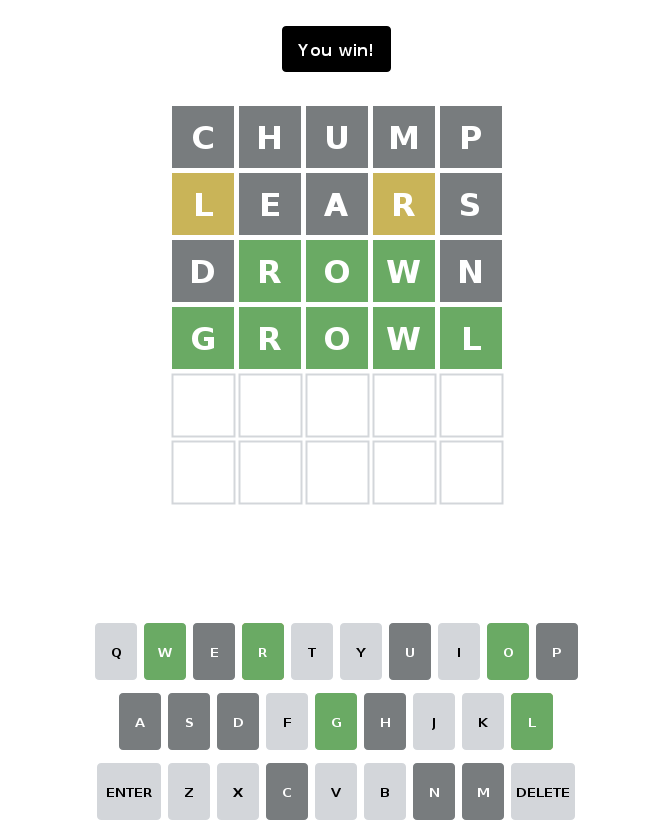

# wordle-swing-why
Anatomically correct wordle written in swing without animations because those
were too much work

Basically I was TAing for APCS and the teacher suggested we make a new
assignment--wordle would be topical and kinda cool to do. So I wrote an
implementation of Wordle in Java with Swing because I figured I should probably
learn swing at some point. Here it is. Dunno why I put it on here but some of
the stuff is kinda cool a little maybe. Maybe a job could see this and be like
"whoah he made an anatomically correct wordle we should hire this guy."

Here's what it looks like

I promise it's not just a screen grab of the original wordle because it looks
so perfectly identical (hence anatomically correct). I actually just used the
values from the real wordle so it should be well and truly identical.

